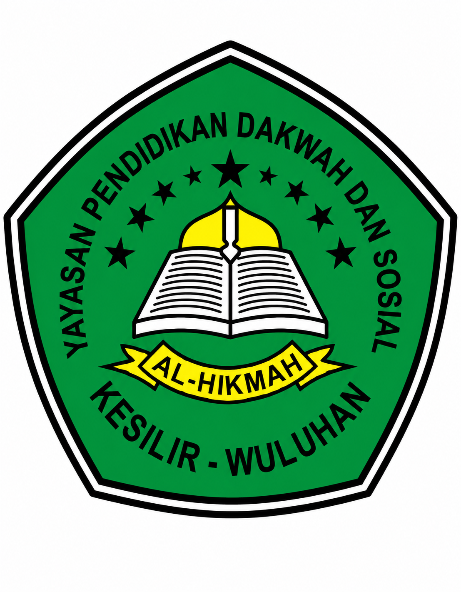

<p align="center">
  
</p>

<h1 align="center">🕌 YPDS Al-Hikmah Jember — Portal Web Resmi</h1>

<p align="center">
  <strong>Website resmi Yayasan Pendidikan Diniyah Sosial (YPDS) Al-Hikmah Jember</strong><br>
  Sistem informasi terpadu untuk mengelola profil yayasan, unit pendidikan, berita, PPDB, dan lainnya.
</p>

<p align="center">
  
  
  
  
  
  
</p>

<p align="center">
  🌐 <a href="https://ypdsalhikmahjbr.com">ypdsalhikmahjbr.com</a>
</p>

---

## 📋 Daftar Isi

- [Tentang Project](#-tentang-project)
- [Tech Stack](#-tech-stack)
- [Arsitektur & Struktur Folder](#-arsitektur--struktur-folder)
- [Fitur Utama](#-fitur-utama)
- [Database & Model](#-database--model)
- [Halaman Publik](#-halaman-publik)
- [Panel Admin](#-panel-admin)
- [SEO & Optimasi](#-seo--optimasi)
- [Instalasi & Setup](#-instalasi--setup)
- [Deployment Production](#-deployment-production)
- [Kontributor](#-kontributor)

---

## 📖 Tentang Project

Website portal resmi **YPDS Al-Hikmah Jember** — sebuah yayasan pendidikan Islam yang berlokasi di Ambulu, Jember, Jawa Timur. Website ini menaungi beberapa unit pendidikan:

| Unit | Slug | Deskripsi |
|------|------|-----------|
| **SD NU 22 Full Day Al-Hikmah** | `/sd` | Sekolah Dasar dengan sistem Full Day |
| **SMP Unggulan Al-Hikmah** | `/smp` | SMP dengan kurikulum integrasi pesantren |
| **SMK Al-Hikmah Jember** | `/smk` | SMK yang mencetak tenaga ahli berkarakter santri |
| **PAUD Al-Hikmah** | `/paud` | Pendidikan Anak Usia Dini |
| **TPQ Allimna Al-Hikmah** | `/tpq` | Taman Pendidikan Al-Qur'an |

Setiap unit lembaga memiliki **halaman dinamis tersendiri** yang menampilkan profil, visi-misi, tenaga pendidik, fasilitas, berita, galeri, keunggulan, video, dan informasi PPDB.

---

## 🛠 Tech Stack

### Backend
| Teknologi | Versi | Fungsi |
|-----------|-------|--------|
| **PHP** | ≥ 8.2 | Runtime server |
| **Laravel** | 11.x | Framework backend utama |
| **Inertia.js** | 2.0 | Bridge Laravel ↔ React (SPA tanpa API) |
| **Laravel Sanctum** | 4.0 | Autentikasi session-based |
| **Laravel Breeze** | * | Starter kit autentikasi |
| **Ziggy** | 2.0 | Named route helper di JavaScript |

### Frontend
| Teknologi | Versi | Fungsi |
|-----------|-------|--------|
| **React** | 18.2 | UI library |
| **Tailwind CSS** | 4.x | Utility-first CSS framework |
| **Vite** | 5.x | Build tool & dev server |
| **Headless UI** | 2.0 | Komponen UI accessible |
| **Heroicons** | 2.x | Icon library |
| **React Quill** | 3.8 | Rich text editor (WYSIWYG) |
| **Cropper.js** | 1.6 | Image cropping tool |

### Font
- **Outfit** — Sans-serif utama
- **Playfair Display** — Serif dekoratif

---

## 🏗 Arsitektur & Struktur Folder

```
PondokanAmbulu/
├── app/
│   ├── Http/
│   │   ├── Controllers/
│   │   │   ├── IndukAdmin/        # Controller panel admin yayasan
│   │   │   │   ├── Auth/          # Login, logout, reset password
│   │   │   │   ├── LembagaController.php
│   │   │   │   ├── BeritaController.php
│   │   │   │   ├── BeritaCategoryController.php
│   │   │   │   ├── LandingController.php
│   │   │   │   ├── EventController.php
│   │   │   │   ├── TestimonialController.php
│   │   │   │   ├── PengajarController.php
│   │   │   │   ├── FasilitasAdminController.php
│   │   │   │   ├── GaleriAdminController.php
│   │   │   │   ├── InfoPPDBController.php
│   │   │   │   ├── PpdbInfoController.php
│   │   │   │   ├── KontakController.php
│   │   │   │   ├── TentangAdminController.php
│   │   │   │   └── SiteSettingController.php
│   │   │   ├── IndukPage/         # Controller halaman publik
│   │   │   │   ├── HomeController.php      # Home + Sitemap
│   │   │   │   ├── BeritaController.php    # Berita list & detail
│   │   │   │   ├── FasilitasController.php
│   │   │   │   ├── TentangController.php
│   │   │   │   ├── KontakController.php
│   │   │   │   └── InfoPPDBController.php
│   │   │   └── LembagaPage/      # Controller halaman per-lembaga
│   │   │       └── SchoolController.php
│   │   ├── Middleware/
│   │   │   └── HandleInertiaRequests.php
│   │   └── Requests/
│   ├── Models/                    # 15 Eloquent Models
│   │   ├── Berita.php
│   │   ├── BeritaCategory.php
│   │   ├── Event.php
│   │   ├── Faq.php
│   │   ├── Fasilitas.php
│   │   ├── Galeri.php
│   │   ├── Kegiatan.php
│   │   ├── LandingSetting.php
│   │   ├── Lembaga.php
│   │   ├── Pengajar.php
│   │   ├── PpdbInfo.php
│   │   ├── Prestasi.php
│   │   ├── SiteSetting.php
│   │   ├── Testimonial.php
│   │   └── User.php
│   └── Providers/
├── resources/
│   ├── css/
│   │   └── app.css
│   ├── js/
│   │   ├── app.jsx                # Entry point React
│   │   ├── Components/            # 14 reusable components
│   │   │   ├── ImageCropperModal.jsx
│   │   │   ├── ImageGalleryModal.jsx
│   │   │   ├── ConfirmationModal.jsx
│   │   │   ├── Toast.jsx
│   │   │   └── ... (form inputs, buttons, dll)
│   │   ├── Layouts/
│   │   │   ├── PublicLayout.jsx   # Layout halaman publik
│   │   │   ├── NavbarInduk.jsx    # Navbar utama
│   │   │   ├── Footer.jsx
│   │   │   ├── Induk/             # Layout admin yayasan
│   │   │   │   ├── IndukAdminLayout.jsx
│   │   │   │   ├── SidebarInduk.jsx
│   │   │   │   └── TopbarInduk.jsx
│   │   │   └── Lembaga/           # Layout admin lembaga
│   │   │       ├── LembagaAdminLayout.jsx
│   │   │       ├── SidebarLembaga.jsx
│   │   │       └── TopbarLembaga.jsx
│   │   └── Pages/
│   │       ├── IndukPage/         # Halaman publik
│   │       │   ├── Home/          # 12 section components
│   │       │   ├── Berita/        # Index, Show, NewsCard, Ticker
│   │       │   ├── Fasilitas/
│   │       │   ├── InfoPPDB/
│   │       │   ├── Kontak/
│   │       │   └── Tentang/
│   │       ├── LembagaPage/       # Halaman per-lembaga
│   │       │   ├── Home.jsx
│   │       │   └── Partials/      # 13 section components
│   │       ├── IndukAdmin/        # Panel admin
│   │       │   ├── Dashboard.jsx
│   │       │   ├── Auth/
│   │       │   ├── Lembaga/
│   │       │   ├── Berita/
│   │       │   ├── Landing/
│   │       │   ├── Settings/
│   │       │   ├── InfoPPDB/
│   │       │   ├── Fasilitas/
│   │       │   ├── Kontak/
│   │       │   ├── Tentang/
│   │       │   └── Alumni/
│   │       └── HandleError/
│   │           ├── Error.jsx
│   │           └── Maintenance.jsx
│   └── views/
│       └── app.blade.php         # Master template + SEO meta tags
├── database/
│   ├── migrations/               # 37 migration files
│   └── seeders/                  # 11 seeder files
├── routes/
│   ├── web.php                   # Semua route (public + admin)
│   └── auth.php                  # Route autentikasi
├── public/
│   ├── robots.txt                # Konfigurasi crawler
│   ├── sitemap.xml               # Dynamic (via controller)
│   └── favicon & logo assets
├── deploy-production.sh          # Script deploy otomatis
├── vite.config.js
├── SEO_IMPLEMENTATION.md         # Dokumentasi strategi SEO
└── README.md                     # ← File ini
```

---

## ✨ Fitur Utama

### 🌍 Halaman Publik
- **Landing Page** — Hero carousel berita, section lembaga, testimoni, fasilitas, event, video, CTA PPDB
- **Halaman Lembaga Dinamis** — Setiap unit (`/sd`, `/smp`, `/smk`, dll) punya halaman lengkap dengan:
  - Hero banner & stats bar
  - Running text pengumuman
  - Profil & filosofi lembaga
  - Tenaga pendidik
  - Keunggulan program
  - Video YouTube embed
  - Berita & kegiatan
  - Info PPDB
  - Galeri foto fasilitas
  - CTA pendaftaran
- **Portal Berita** — Index dengan filter kategori, pencarian, sticky news, dan detail artikel
- **Halaman Fasilitas** — Galeri fasilitas yayasan
- **Info PPDB** — Informasi pendaftaran dengan FAQ accordion
- **Halaman Profil** — Tentang yayasan
- **Halaman Kontak** — Informasi kontak, maps, dan sosial media

### 🔐 Panel Admin (`/admin/console`)
- **Dashboard** — Statistik total lembaga, berita, pengajar, event, testimoni, fasilitas
- **Manajemen Lembaga** — CRUD lengkap dengan editor profil, hero, visi-misi, keunggulan, custom section titles, video YouTube, sidebar configuration
- **Manajemen Berita** — CRUD artikel dengan rich text editor (React Quill), image cropper, kategori, sticky news, multimedia tag
- **Kategori Berita** — CRUD kategori
- **Landing Page Settings** — Konfigurasi hero news, announcement, article sections, bottom news
- **Testimonial & Event** — CRUD data landing page
- **Pengajar** — CRUD data tenaga pendidik per lembaga
- **Fasilitas & Galeri** — CRUD per lembaga dengan upload gambar
- **Info PPDB** — Kelola informasi pendaftaran & FAQ per lembaga
- **Kontak & Tentang** — Edit informasi kontak & profil yayasan
- **Site Settings** — Konfigurasi SEO, sosial media, logo, background login, dan akun admin

### 🖼 Komponen Pendukung
- **Image Cropper Modal** — Crop gambar sebelum upload (aspect ratio custom)
- **Image Gallery Modal** — Lightbox galeri foto
- **Confirmation Modal** — Dialog konfirmasi aksi destructive
- **Toast Notification** — Flash message sukses/error
- **News Ticker** — Running text berita

---

## 🗄 Database & Model

### Entity Relationship

```
User (super_admin / lembaga_admin)
  └── belongsTo → Lembaga

Lembaga
  ├── hasMany → Prestasi
  ├── hasMany → Kegiatan
  ├── hasOne  → PpdbInfo
  ├── hasMany → Berita (via lembaga_id)
  ├── hasMany → Pengajar
  └── hasMany → Fasilitas → hasMany → Galeri

Berita
  ├── belongsTo → BeritaCategory
  └── belongsTo → Lembaga

SiteSetting (key-value store)
LandingSetting (key-value store)
Testimonial
Event
Faq
```

### Model Utama

| Model | Tabel | Deskripsi |
|-------|-------|-----------|
| `Lembaga` | `lembagas` | Unit pendidikan (SD, SMP, SMK, dll) |
| `Berita` | `beritas` | Artikel/berita dengan kategori |
| `BeritaCategory` | `berita_categories` | Kategori berita |
| `Pengajar` | `pengajars` | Tenaga pendidik per lembaga |
| `Fasilitas` | `fasilitas` | Fasilitas per lembaga |
| `Galeri` | `galeris` | Foto galeri per fasilitas |
| `Prestasi` | `prestasis` | Pencapaian per lembaga |
| `Kegiatan` | `kegiatans` | Aktivitas per lembaga |
| `PpdbInfo` | `ppdb_infos` | Info PPDB per lembaga |
| `Event` | `events` | Event yayasan |
| `Testimonial` | `testimonials` | Testimoni alumni/wali |
| `Faq` | `faqs` | FAQ pendaftaran |
| `SiteSetting` | `site_settings` | Pengaturan global website |
| `LandingSetting` | `landing_settings` | Pengaturan halaman landing |
| `User` | `users` | Admin (super_admin / lembaga_admin) |

---

## 🌐 Halaman Publik

### Routing

| Method | URL | Controller | Deskripsi |
|--------|-----|------------|-----------|
| GET | `/` | `HomeController@index` | Landing page |
| GET | `/berita` | `BeritaController@index` | Daftar berita |
| GET | `/berita/kategori/{slug}` | `BeritaController@index` | Filter per kategori |
| GET | `/berita/{slug}` | `BeritaController@show` | Detail berita |
| GET | `/profil` | `TentangController@profil` | Profil yayasan |
| GET | `/info-ppdb` | `InfoPPDBController@index` | Info pendaftaran |
| GET | `/fasilitas` | `FasilitasController@index` | Fasilitas yayasan |
| GET | `/kontak` | `KontakController@index` | Kontak & lokasi |
| GET | `/sitemap.xml` | `HomeController@sitemap` | Dynamic XML sitemap |
| GET | `/{slug}` | `SchoolController@show` | Halaman lembaga dinamis |

---

## 🔧 Panel Admin

Semua route admin berada di prefix `/admin/console` dan dilindungi middleware `auth`.

### Fitur Admin

| Modul | Route Prefix | Fitur |
|-------|-------------|-------|
| Dashboard | `/admin/console/dashboard` | Statistik & overview |
| Lembaga | `/admin/console/lembaga` | CRUD unit pendidikan |
| Berita | `/admin/console/berita` | CRUD artikel + settings |
| Kategori Berita | `/admin/console/berita-category` | CRUD kategori |
| Landing | `/admin/console/landing` | Konfigurasi landing page |
| Testimonial | `/admin/console/testimonials` | CRUD testimoni |
| Event | `/admin/console/events` | CRUD event |
| Pengajar | `/admin/console/pengajar` | CRUD tenaga pendidik |
| Fasilitas | `/admin/console/fasilitas` | CRUD fasilitas |
| Info PPDB | `/admin/console/info-ppdb` | Kelola PPDB & FAQ |
| Tentang | `/admin/console/tentang` | Edit profil yayasan |
| Kontak | `/admin/console/kontak` | Edit info kontak |
| Settings | `/admin/console/settings` | SEO, sosmed, akun |

### Role System

| Role | Akses |
|------|-------|
| `super_admin` | Full akses semua modul |
| `lembaga_admin` | Akses terbatas ke lembaga sendiri |

---

## 🔍 SEO & Optimasi

Project ini mengimplementasikan SEO tingkat lanjut (lihat `SEO_IMPLEMENTATION.md`):

- ✅ **Server-Side Meta Tags** — Title, description, OG, Twitter Card dirender di Blade (`app.blade.php`) agar terbaca oleh crawler WhatsApp/Facebook
- ✅ **Schema.org JSON-LD** — `EducationalOrganization`, `School`, `WebSite` dengan `SearchAction`
- ✅ **Dynamic XML Sitemap** — Auto-generate dari database (`/sitemap.xml`)
- ✅ **Canonical URL** — Menghindari duplikat konten
- ✅ **robots.txt** — Konfigurasi crawler lengkap, blokir area admin
- ✅ **Google Verification** — File `googlecf4c31d1790bf6f0.html`
- ✅ **Friendly URL (Slug)** — Semua halaman menggunakan slug SEO-friendly
- ✅ **Image Alt Otomatis** — Alt text dari judul berita/nama lembaga
- ✅ **Image Sitemap** — Gambar berita terindeks di Google Images
- ✅ **PWA Manifest** — `site.webmanifest` + favicon set lengkap

---

## 🚀 Instalasi & Setup

### Prasyarat

- PHP ≥ 8.2 dengan ekstensi: `mbstring`, `openssl`, `pdo`, `tokenizer`, `xml`, `ctype`, `json`
- Composer ≥ 2.x
- Node.js ≥ 18.x & npm
- MySQL / MariaDB / SQLite

### Langkah Instalasi

```bash
# 1. Clone repository
git clone <repository-url>
cd PondokanAmbulu

# 2. Install dependensi PHP
composer install

# 3. Install dependensi Node.js
npm install

# 4. Setup environment
cp .env.example .env
php artisan key:generate

# 5. Konfigurasi database di .env
# DB_CONNECTION=mysql
# DB_HOST=127.0.0.1
# DB_PORT=3306
# DB_DATABASE=pondokan_ambulu
# DB_USERNAME=root
# DB_PASSWORD=

# 6. Jalankan migrasi & seeder
php artisan migrate
php artisan db:seed

# 7. Buat symbolic link storage
php artisan storage:link

# 8. Jalankan dev server
php artisan serve    # Terminal 1 — Backend (port 8000)
npm run dev          # Terminal 2 — Vite (HMR)
```

### Default Login

| Username | Password | Role |
|----------|----------|------|
| `admin` | `password` | Super Admin |
| `sd_admin` | `password` | Admin SD |
| `smp_admin` | `password` | Admin SMP |
| `smk_admin` | `password` | Admin SMK |
| `paud_admin` | `password` | Admin PAUD |
| `tpq_admin` | `password` | Admin TPQ |

> ⚠️ **Ganti password default sebelum deploy ke production!**

---

## 🚢 Deployment Production

Script deploy otomatis tersedia di `deploy-production.sh`:

```bash
chmod +x deploy-production.sh
./deploy-production.sh
```

Script ini akan menjalankan:
1. `git pull origin main` — Tarik update terbaru
2. `composer install --no-dev` — Install dependensi production
3. `npm ci && npm run build` — Build frontend assets
4. `php artisan optimize:clear` — Bersihkan cache lama
5. `php artisan config:cache` — Cache konfigurasi
6. `php artisan route:cache` — Cache routing
7. `php artisan view:cache` — Cache view
8. `php artisan migrate --force` — Jalankan migrasi
9. `php artisan storage:link` — Buat symlink storage

### Build Manual

```bash
# Build assets frontend untuk production
npm run build

# Optimasi Laravel
php artisan optimize
```

---

## 👥 Kontributor

Dikembangkan untuk **Yayasan Pendidikan Diniyah Sosial (YPDS) Al-Hikmah Jember**.

---

<p align="center">
  <sub>Built with ❤️ using Laravel 11 + React 18 + Inertia.js</sub>
</p>
