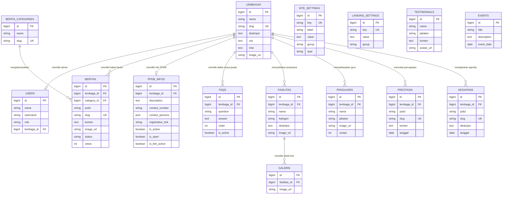

# 🏫 Portal Yayasan Pendidikan Diniyah Sosial (YPDS) Al-Hikmah Jember
[](https://laravel.com)
[](https://react.dev)
[](https://inertiajs.com)
[](https://tailwindcss.com)
[](https://vitejs.dev)

Aplikasi web portal dinamis untuk **Yayasan Pendidikan Diniyah Sosial (YPDS) Al-Hikmah Jember** yang dirancang sebagai pusat informasi terintegrasi dan sistem pendaftaran siswa baru (PPDB) untuk seluruh unit pendidikan (SD, SMP, SMK, PAUD, TPQ). Proyek ini dibangun menggunakan arsitektur modern SPA (Single Page Application) berbasis **Laravel 11**, **React 18**, **Inertia.js 2.0**, dan **Tailwind CSS 4.x**.

---

## 📌 Daftar Isi
- [✨ Fitur Utama](#-fitur-utama)
- [🛠️ Tech Stack & Dependencies](#%EF%B8%8F-tech-stack--dependencies)
- [📂 Arsitektur Proyek & Folder](#-arsitektur-proyek--folder)
- [🗄️ Database & Hubungan Model](#%EF%B8%8F-database--hubungan-model)
- [🔐 Hak Akses & Alur Autentikasi](#-hak-akses--alur-autentikasi)
- [📈 Suite SEO & Prerendering](#-suite-seo--prerendering)
- [⚙️ Pengaturan Panel Admin](#%EF%B8%8F-pengaturan-panel-admin)
- [🚀 Instalasi & Konfigurasi Lokal](#-instalasi--konfigurasi-lokal)
- [📦 Panduan Deployment Produksi](#-panduan-deployment-produksi)

---

## ✨ Fitur Utama

### 1. Multi-Lembaga Dinamis (Dynamic Institution Pages)
*   **Halaman Unit Terdedikasi:** Setiap unit pendidikan memiliki subdomain virtual/route slug sendiri (`/sd`, `/smp`, `/smk`, `/paud`, `/tpq`) yang datanya dikelola secara independen.
*   **Banner & Deskripsi Unik:** Masing-masing unit dapat mengatur logo, gambar background hero desktop/mobile, visi-misi, serta tagline pendaftaran.
*   **Running Text Banner:** Banner teks berjalan untuk pengumuman darurat atau informasi penting spesifik lembaga.

### 2. Panel Admin Berbasis Peran (Role-Based Admin Console)
*   **Super Admin (Admin Induk):** Memiliki kontrol penuh atas pengaturan yayasan, landing page utama, pembuatan unit lembaga baru, kategori berita, database FAQ global, dan registrasi akun.
*   **Lembaga Admin:** Admin tingkat unit (misal: `sd_admin`) yang hanya memiliki hak akses untuk mengelola berita, fasilitas, galeri, daftar pengajar, prestasi, kegiatan, dan info PPDB khusus untuk unit mereka sendiri.

### 3. Portal Berita Terintegrasi (Al-Hikmah NEWS)
*   **Pengaturan Sticky & Kategori:** Mendukung berita utama (`is_sticky`) dan penyaringan berbasis kategori.
*   **Multimedia News:** Khusus untuk artikel berita yang memuat konten video/multimedia.
*   **View Counter:** Sistem pencatatan analitik jumlah tayangan berita secara *real-time*.

### 4. Manajemen PPDB & FAQ Dinamis
*   **Status Pendaftaran Terkontrol:** Toggle aktif/nonaktif untuk pendaftaran serta tombol link pendaftaran eksternal.
*   **Daftar Kontak Person:** Input nama dan nomor telepon kontak person dalam format array JSON dinamis.
*   **Sistem FAQ Unit:** Pertanyaan yang sering diajukan (FAQ) dapat diatur urutannya (`order`) untuk mempermudah calon wali santri.

### 5. Media Cropper & Video Embed System
*   **Image Cropper Modal:** Integrasi Cropper.js pada panel admin untuk memastikan semua unggahan gambar (21:9 hero, 4:3 fasilitas, 3:4 profil) dipotong dengan rasio ideal sebelum disimpan ke server.
*   **YouTube Video Slider:** Fitur input tautan YouTube secara dinamis, yang secara otomatis memisahkan ID video untuk ditampilkan sebagai pemutar video responsif di landing page.

---

## 🛠️ Tech Stack & Dependencies

### Backend
*   **Laravel 11.x** (PHP >= 8.2)
*   **Laravel Sanctum & Breeze** (Autentikasi sesi & pengelolaan password)
*   **Inertia.js 2.0** (Pengiriman data backend ke frontend tanpa API overhead)

### Frontend
*   **React 18.x** (UI Rendering & State management)
*   **Tailwind CSS 4.x** (Styling modern & responsif)
*   **Vite 5.x** (Asset bundler super cepat)
*   **Headless UI & Heroicons** (Aksesibilitas komponen UI & ikon premium)
*   **React Quill** (Rich Text Editor untuk penulisan konten berita)
*   **Cropper.js** (Library pemotong gambar interaktif)

---

## 📂 Arsitektur Proyek & Folder

Berikut adalah visualisasi struktur folder utama yang memisahkan logika backend dan komponen frontend:

```
PondokanAmbulu/
├── app/
│   ├── Http/
│   │   ├── Controllers/
│   │   │   ├── IndukAdmin/        # Controller untuk Dashboard Admin Induk
│   │   │   ├── IndukPage/         # Controller untuk halaman Publik Yayasan
│   │   │   └── LembagaPage/       # Controller untuk halaman Publik Sekolah/Unit
│   │   └── Middleware/            # Middleware (ShareInertiaProps, Role check)
│   └── Models/                    # Eloquent Models (15 model)
├── config/                        # File konfigurasi Laravel
├── database/
│   ├── migrations/                # Database Schema migrations
│   └── seeders/                   # Data Seeder awal (Super Admin & Data Awal)
├── resources/
│   ├── js/
│   │   ├── Components/            # Komponen UI Reusable (Toast, Cropper, Modal)
│   │   ├── Layouts/               # Layout Utama (Induk, Admin, Guest)
│   │   ├── Pages/                 # Halaman Render React
│   │   │   ├── IndukAdmin/        # Dashboard Management Pages
│   │   │   ├── IndukPage/         # Public Portal Pages
│   │   │   └── LembagaPage/       # Halaman Unit Sekolah
│   │   └── app.jsx                # Entrypoint aplikasi React
│   └── views/
│       └── app.blade.php          # Root HTML Template & Dynamic SEO Prerender
├── routes/
│   ├── auth.php                   # Rute Autentikasi (Breeze)
│   └── web.php                    # Rute Aplikasi (Dashboard & Publik)
├── vite.config.js                 # Konfigurasi bundling Vite + Tailwind 4
└── deploy-production.sh           # Script otomatisasi deployment
```

---

## 🗄️ Database & Hubungan Model

Aplikasi ini menggunakan 15 model database yang saling berhubungan erat untuk mendukung manajemen multi-lembaga:



### Penjelasan Detail Model Utama:
1.  **`Lembaga`**: Menyimpan konfigurasi dan aset visual untuk masing-masing sekolah/unit pendidikan. Memiliki relasi `hasMany` ke pengajar, fasilitas, prestasi, kegiatan, dan relasi `hasOne` ke `PpdbInfo`.
2.  **`User`**: Akun pengguna sistem. Memiliki kolom `role` (`super_admin` atau `lembaga_admin`) dan `lembaga_id` (opsional, hanya terisi untuk admin sekolah).
3.  **`Berita`**: Menyimpan artikel kabar yayasan dan sekolah. Kolom `lembaga_id` diatur `nullable` (jika bernilai null, berarti berita milik yayasan umum).
4.  **`PpdbInfo`**: Menyimpan data kontak pendaftaran, deskripsi gelombang, dan link eksternal PPDB per lembaga. Kolom `contact_persons` bertipe data `JSON/array` untuk fleksibilitas jumlah narahubung.
5.  **`SiteSetting` & `LandingSetting`**: Key-value store global untuk konfigurasi SEO yayasan, link media sosial, dan penataan beranda (Hero slider, video, testimonial).

---

## 🔐 Hak Akses & Alur Autentikasi

Aplikasi ini menggunakan otentikasi berbasis sesi (Laravel Breeze) dengan otorisasi berbasis middleware untuk membatasi kontrol panel:

| Fitur / Modul | Super Admin (Induk) | Lembaga Admin (Unit) | Pengunjung Publik |
| :--- | :---: | :---: | :---: |
| Mengakses Landing Page & Portal | ✅ Lihat | ✅ Lihat | ✅ Lihat |
| Mengakses Dashboard `/admin/console` | ✅ Full Akses | ✅ Terbatas Unit | ❌ Ditolak |
| CRUD Lembaga & Akun Pengguna | ✅ Ya | ❌ Tidak | ❌ Tidak |
| Mengatur SEO Global Yayasan | ✅ Ya | ❌ Tidak | ❌ Tidak |
| CRUD Berita Yayasan (Umum) | ✅ Ya | ❌ Tidak | ❌ Tidak |
| CRUD Berita & Konten Unit | ✅ Ya | ✅ Hanya Unit Sendiri | ❌ Tidak |
| Kustomisasi Gambar Latar Login | ✅ Ya | ❌ Tidak | ❌ Tidak |

*   **Logika Pembatasan Route:** Kontrol akses didasarkan pada middleware `RoleMiddleware`. Ketika admin unit mencoba mengubah data milik unit lain melalui manipulasi ID di HTTP Request, Controller akan memicu `abort(403)` melalui validasi kepemilikan data:
    ```php
    if (auth()->user()->role !== 'super_admin' && auth()->user()->lembaga_id !== $lembaga->id) {
        abort(403, 'Anda tidak memiliki hak akses untuk unit ini.');
    }
    ```

---

## 📈 Suite SEO & Prerendering

Yayasan Al-Hikmah Jember dilengkapi sistem optimasi mesin pencari terpadu demi memastikan seluruh konten dan unit pendidikan mudah ditemukan di Google:

### 1. Prerendering Server-Side Meta Tags (`resources/views/app.blade.php`)
Karena aplikasi ini adalah Single Page Application (SPA), crawler sosial (WhatsApp, Facebook, Telegram) tidak mengeksekusi JavaScript saat membuat cuplikan link. Aplikasi mengatasi ini dengan menyisipkan tag meta Open Graph (`og:title`, `og:description`, `og:image`) secara langsung menggunakan PHP murni di file template blade sebelum Inertia dimuat:
```html
<meta name="description" content="{{ $seoDescription }}">
<meta property="og:title" content="{{ $seoTitle }}">
<meta property="og:description" content="{{ $seoDescription }}">
<meta property="og:image" content="{{ $seoImage }}">
```

### 2. JSON-LD Structured Data Schema.org
Menambahkan markup terstruktur tipe `EducationalOrganization` dan `WebSite` pada halaman depan untuk memicu fitur Google Sitelinks secara otomatis, sehingga Google menampilkan sub-link langsung ke unit sekolah di bawah hasil pencarian yayasan.

### 3. Sitemap XML Dinamis (`/sitemap.xml`)
Rute sitemap merender struktur XML secara langsung dari database dalam waktu nyata (real-time). Setiap ada perubahan slug berita atau penambahan unit pendidikan, berkas sitemap akan otomatis diperbarui untuk dirayapi oleh Google Search Console.

---

## ⚙️ Pengaturan Panel Admin

Pengaturan portal dan tampilan dibagi menjadi beberapa bagian utama di panel admin:

*   **Pengaturan Beranda:** Berisi form manajemen banner hero (mendukung crop rasio 21:9 desktop & 3:4 mobile), kartu fitur, angka statistik (alumni, guru, dsb), video galeri YouTube, serta testimoni wali murid.
*   **Pengaturan Sistem (SEO & Keamanan):**
    *   **Tab Pengaturan SEO:** Mengedit deskripsi metadata global dan kata kunci (keywords) yang disuntikkan ke crawler.
    *   **Tab Kustomisasi Login:** Mengubah gambar latar belakang portal login admin secara dinamis (mendukung tautan URL gambar luar atau unggah langsung dengan crop otomatis).
    *   **Tab Akun & Keamanan:** Mengganti username super admin dan memperbarui sandi masuk.

---

## 🚀 Instalasi & Konfigurasi Lokal

Ikuti langkah-langkah di bawah ini untuk memasang proyek di lingkungan lokal Anda:

### Prasyarat
*   PHP >= 8.2 (Pastikan ekstensi `gd`, `pdo`, `mbstring`, dan `xml` aktif)
*   Composer
*   Node.js (versi 18 atau lebih baru) & NPM
*   MySQL atau MariaDB (atau SQLite)

### Langkah-Langkah Pemasangan

1.  **Clone Repository & Masuk ke Folder**
    ```bash
    git clone https://github.com/username/PondokanAmbulu.git
    cd PondokanAmbulu
    ```

2.  **Instal Dependensi Backend (PHP)**
    ```bash
    composer install
    ```

3.  **Instal Dependensi Frontend (Node.js)**
    ```bash
    npm install
    ```

4.  **Salin File Konfigurasi Lingkungan (`.env`)**
    ```bash
    copy .env.example .env
    # di Linux/Mac: cp .env.example .env
    ```

5.  **Konfigurasi Database di `.env`**
    Sesuaikan driver, host, nama database, nama pengguna, dan sandi:
    ```env
    DB_CONNECTION=mysql
    DB_HOST=127.0.0.1
    DB_PORT=3306
    DB_DATABASE=db_pondokan_ambulu
    DB_USERNAME=root
    DB_PASSWORD=
    ```

6.  **Buat App Key Baru**
    ```bash
    php artisan key:generate
    ```

7.  **Jalankan Migrasi & Pengisian Data Awal (Seeder)**
    ```bash
    php artisan migrate --seed
    ```
    *Seeder utama akan otomatis membuat satu akun **Super Admin** dan akun **Lembaga Admin** untuk masing-masing unit.*

8.  **Hubungkan Folder Penyimpanan (Symlink Storage)**
    ```bash
    php artisan storage:link
    ```

9.  **Jalankan Server Pengembangan (Lokal)**
    Buka dua terminal terpisah:
    *   **Terminal 1 (Laravel Server):**
        ```bash
        php artisan serve
        ```
    *   **Terminal 2 (Vite Development Bundler):**
        ```bash
        npm run dev
        ```

10. **Akses Aplikasi**
    *   Portal Publik: `http://127.0.0.1:8000`
    *   Portal Admin: `http://127.0.0.1:8000/login`

---

## 🔐 Kredensial Default (Lokal & Pengembangan)

Berikut adalah detail akun bawaan hasil seeder untuk kebutuhan pengujian di komputer lokal:

*   **Super Admin (Yayasan):**
    *   Username: `admin`
    *   Password: `password`
*   **Admin SD NU 22 Full Day:**
    *   Username: `sd_admin`
    *   Password: `password`
*   **Admin SMP Unggulan Al-Hikmah:**
    *   Username: `smp_admin`
    *   Password: `password`
*   **Admin SMK Al-Hikmah Jember:**
    *   Username: `smk_admin`
    *   Password: `password`
*   **Admin PAUD Al-Hikmah:**
    *   Username: `paud_admin`
    *   Password: `password`
*   **Admin TPQ Allimna Al-Hikmah:**
    *   Username: `tpq_admin`
    *   Password: `password`

> [!WARNING]
> Sangat disarankan untuk segera mengubah seluruh password akun di atas melalui halaman **Pengaturan > Akun & Keamanan** setelah sistem dipasang di peladen produksi (live server).

---

## 📦 Panduan Deployment Produksi

Terdapat file script otomatis `deploy-production.sh` di dalam proyek ini yang siap digunakan untuk memperbarui aplikasi di server produksi VPS/Cloud Server.

### Script Otomatis (`deploy-production.sh`)
Pastikan file script memiliki izin eksekusi (`chmod +x deploy-production.sh`) lalu jalankan:
```bash
./deploy-production.sh
```

Alur yang dijalankan oleh script ini meliputi:
1.  **Git:** Menarik pembaruan kode terbaru (`git pull origin main`).
2.  **Dependencies:** Menginstal composer production (`composer install --no-dev --optimize-autoloader`) dan frontend dependencies (`npm ci`).
3.  **Frontend Build:** Mengompilasi ulang aset produksi dengan Vite (`npm run build`).
4.  **Database Migration:** Menjalankan migrasi database baru secara aman (`php artisan migrate --force`).
5.  **Caching & Optimization:**
    ```bash
    php artisan optimize:clear
    php artisan config:cache
    php artisan route:cache
    php artisan view:cache
    ```
6.  **Symlink Check:** Memastikan tautan folder publik storage berfungsi dengan baik.

### Konfigurasi Penting Server (Nginx)
Jika Anda menggunakan web server Nginx, pastikan konfigurasi server block Anda mengarah ke direktori `/public` dan mendukung pembacaan berkas XML sitemap serta SPA routing:

```nginx
server {
    listen 80;
    server_name ypdsalhikmahjbr.com www.ypdsalhikmahjbr.com;
    root /var/www/PondokanAmbulu/public;

    add_header X-Frame-Options "SAMEORIGIN";
    add_header X-Content-Type-Options "nosniff";

    index index.php;
    charset utf-8;

    location / {
        try_files $uri $uri/ /index.php?$query_string;
    }

    location = /favicon.ico { access_log off; log_not_found off; }
    location = /robots.txt  { access_log off; log_not_found off; }
    location = /sitemap.xml {
        try_files $uri /index.php?$query_string;
    }

    error_page 404 /index.php;

    location ~ \.php$ {
        fastcgi_pass unix:/var/run/php/php8.2-fpm.sock;
        fastcgi_param SCRIPT_FILENAME $realpath_root$fastcgi_script_name;
        include fastcgi_params;
    }

    location ~ /\.(?!well-known).* {
        deny all;
    }
}
```

---

<p align="center">
  <sub>Dikembangkan untuk <strong>Yayasan Pendidikan Diniyah Sosial (YPDS) Al-Hikmah Jember</strong></sub><br/>
  <sub>Built with ❤️ using Laravel 11 + React 18 + Inertia.js 2.0</sub>
</p>
